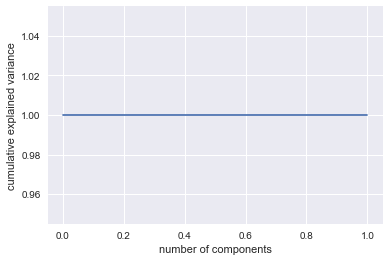

```python
%matplotlib inline
import numpy as np
import matplotlib.pyplot as plt
import seaborn as sns; sns.set()
import pandas as pd
import numpy as np
from sklearn.decomposition import PCA
from scipy.linalg import lu

```

## Basic Matrix Syntax

### Initializing a 2x2 matrix


```python
matrix = np.array([[2,-1],[1,-2]])
print(matrix)
```

    [[ 2 -1]
     [ 1 -2]]


### Transposing matrix


```python
print(matrix.transpose())
```

    [[4 4]
     [2 3]]


### Matrix multiplication


```python
A = np.array([[1,1],[0,0]])
B = np.array([[0,0],[2,0]])
AB = np.dot(A,B)
print(AB)
```

    [[2 0]
     [0 0]]


### Determinant of matrix


```python
detMatrix = np.linalg.det(matrix)
print(detMatrix)
```

    4.0


### Inverse of matrix


```python
invMatrix = np.linalg.inv(matrix)
print(invMatrix)
```

    [[ 0.66666667 -0.33333333]
     [ 0.33333333 -0.66666667]]


### Example of solving a system of linear equations
- 2 methods:
    - get inverse and matrix multiplication
    - solve with innate function

#### Solve with innate function


```python
example_matrix = np.array([[2,-1],[1,-2]])
example_numeric = np.array([[6],[3]])
np.linalg.solve(example_matrix, example_numeric)
```


    array([[ 3.],
           [-0.]])


#### Solve with inverse and matrix multiplication


```python
np.dot(np.linalg.inv(example_matrix),example_numeric)
```


    array([[3.],
           [0.]])


## Basic Vectors/Spaces Syntax

### Initializing a vector


```python
vector = np.array([1,2,3])
print(vector)
```

    [1 2 3]


### Inner product of 2 vectors


```python
a = np.array([1,2,3])
b = np.array([0,1,0])
np.inner(a, b)
```


    2


### Norm of a vector


```python
np.linalg.norm(a)
```


    3.7416573867739413


### Euclidean distance of 2 vectors


```python
np.linalg.norm(a-b)
```


    3.3166247903554


## Eigen values and vectors


```python
matrix = np.array([[11,1],[1,11]])
print(np.linalg.eig(matrix))
```

    (array([12., 10.]), array([[ 0.70710678, -0.70710678],
           [ 0.70710678,  0.70710678]]))


### Orthogonal vectors
- gram schmidt process
- we can reference from QR decomposition, where Q is the orthonormal set


```python
A = np.array([[1,0,0], [1,1,0], [1,1,1]])
q, r = np.linalg.qr(A)
q
```


    array([[-5.77350269e-01,  8.16496581e-01, -6.99362418e-17],
           [-5.77350269e-01, -4.08248290e-01, -7.07106781e-01],
           [-5.77350269e-01, -4.08248290e-01,  7.07106781e-01]])


### Singular Value Decomposition (SVD)
- same example in slide


```python
svd_matrix = np.array([[3,1,1],[-1,3,1]])
```


```python
u, s, v = np.linalg.svd(svd_matrix, full_matrices=True)
```


```python
print(u)
```

    [[-0.70710678 -0.70710678]
     [-0.70710678  0.70710678]]


```python
print(s)
```

    [3.46410162 3.16227766]


```python
print(v)
```

    [[-4.08248290e-01 -8.16496581e-01 -4.08248290e-01]
     [-8.94427191e-01  4.47213595e-01  5.27355937e-16]
     [-1.82574186e-01 -3.65148372e-01  9.12870929e-01]]


### Principal Component Analysis (PCA)


```python
example_matrix = np.array([[1,1,2,0,5,4,5,3],[3,2,3,3,4,5,5,4]])
pca = PCA()
```


```python
pca.fit(example_matrix)
```


    PCA(copy=True, iterated_power='auto', n_components=None, random_state=None,
      svd_solver='auto', tol=0.0, whiten=False)


```python
plt.plot(np.cumsum(pca.explained_variance_ratio_))
plt.xlabel('number of components')
plt.ylabel('cumulative explained variance')
```


    Text(0,0.5,'cumulative explained variance')





```python
pca = PCA(n_components=1)
pca.fit(example_matrix)
```


    PCA(copy=True, iterated_power='auto', n_components=1, random_state=None,
      svd_solver='auto', tol=0.0, whiten=False)


```python
pca.components_
```


    array([[ 0.47140452,  0.23570226,  0.23570226,  0.70710678, -0.23570226,
             0.23570226,  0.        ,  0.23570226]])


### LU Decomposition


```python
lu_example = np.array([[3,1],[-6,-4]])

p,l,u = lu(lu_example)
```


```python
p
```


    array([[0., 1.],
           [1., 0.]])


```python
l
```


    array([[ 1. ,  0. ],
           [-0.5,  1. ]])


```python
u
```


    array([[-6., -4.],
           [ 0., -1.]])


